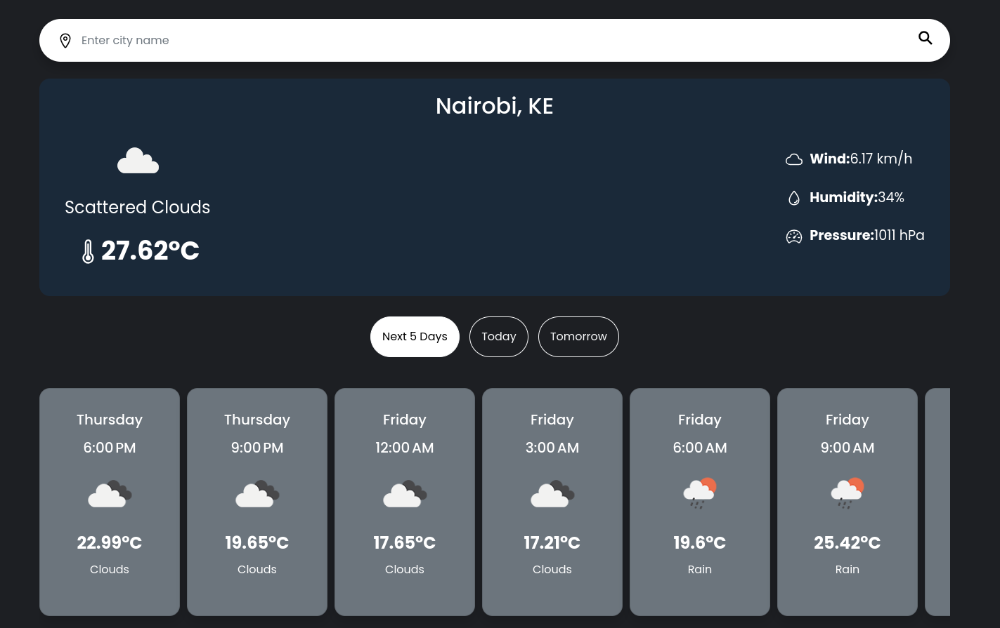

# Weather App with CI/CD Pipeline

## Overview
This project is a Weather Application built using C# and following a Clean Architecture approach. The app fetches current weather and forecast data using the [OpenWeatherMap API](https://openweathermap.org/api) and displays it via an MVC-based web interface as shown below:



The project also integrates a Continuous Integration/Continuous Deployment (CI/CD) pipeline using Jenkins and Docker. The app is containerized and deployed through Docker.

## Project Structure
The project is structured based on Clean Architecture principles:

- **Domain Layer:** Contains the core weather entity.
- **Application Layer:** Handles the business logic. Contains the weather DTO and an interface providing the weather service functions. 
- **Infrastructure Layer:** Manages external API connections.
- **MVC Layer:** For the presentation and interaction with the API.

## Technologies Used
- **C# Clean Architecture**
- **OpenWeatherMap API**
- **Docker** for containerization
- **Jenkins** for CI/CD pipeline automation
- **GitHub** for version control

### How to Run Locally
1. Clone the repository:
   ```bash
   git clone https://github.com/lkendi/WeatherApp.git
   cd <repository-directory>
     ```
2. Build and run the docker container
    ```bash
    docker build -t weather-app .
    docker run -d -p 8080:80 weather-app
    ```
    Alternatively, you can use the docker compose file to make your work easier by running
    ```bash
    docker compose up
    ```
3. Access the application by opening http://localhost:5285 in your browser

### CI/CD Pipeline

The Jenkins pipeline is defined in the `Jenkinsfile`. It automates the following steps:

1.  Pulls the latest code from GitHub.
2.  Builds and tests the application.
3.  Builds the Docker image.
4.  Pushes the Docker image to Docker Hub (private repository).
5.  Deploys the Docker container.

The app icon was created by [riajulislam - Flaticon](https://www.flaticon.com/authors/riajulislam) 